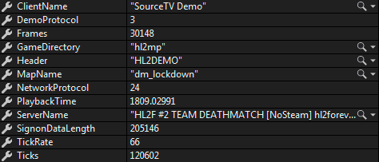

# Source Engine demo parser
A very simple demo parser for Source Engine

# What is it?
It is template for demo proccessing. Now it just prints all console commands.

# Usage
* Build via Visual Studio
* run `dotnet exec SourceEngineDemoParser.dll <path-to-demo1> <path-to-demo2> <path-to-demo3> ...`

# Demo header
* `string` Header 
* `int` DemoProtocol
* `int` NetworkProtocol 
* `string` ServerName 
* `string` ClientName 
* `string` MapName 
* `string` GameDirectory 
* `float` PlaybackTime 
* `int` Ticks 
* `int` Frames 
* `int` SignonDataLength 
* `int` TickRate => `(int)Math.Floor(Ticks / PlaybackTime)`

